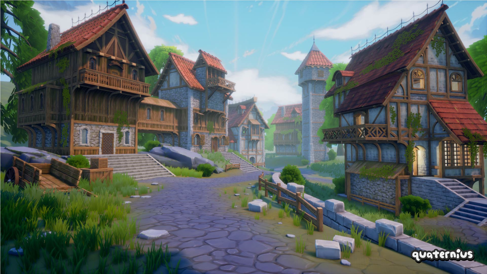

# gltf-medieval-village-megakit
This is the standard FREE version of @Quaternius's Medieval Village MegaKit as distributed on [itch.io](https://quaternius.itch.io/medieval-village-megakit) on 2025-04-22 (with gltf files only to keep the repository as small as possible).

It only contains a portion of the models. You can buy the PRO version which has all the models, or the SOURCE version which has all the models and also includes Unity(URP), Unreal Engine and Godot projects with custom shaders already set up.

You can get the other versions from the author's website https://quaternius.com

# Licence :
The original CC0 1.0 license of the original asset pack has been retained. Full details in [LICENSE](https://github.com/J-Ponzo/gltf-medieval-village-megakit/blob/main/LICENSE)

# Author :
I'm not the author of the asset. It was created by @Quaternius.

You can support him on Patreon : https://www.patreon.com/quaternius
And join his discord Server : https://discord.gg/vJqnRUYRfT

All this information was in the archive downloaded from itch.io and I thought it appropriate to provide it here.
